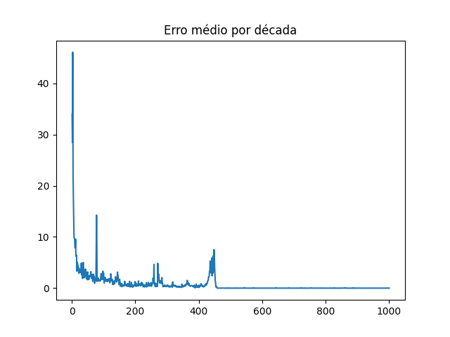
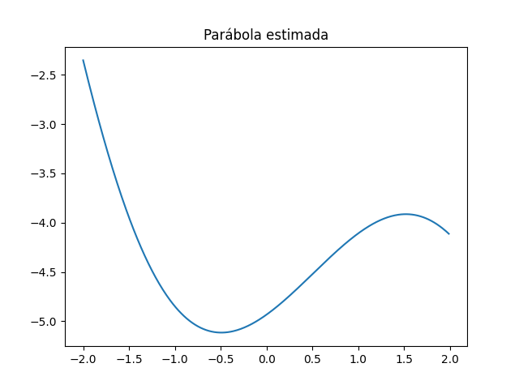

# Algoritmo Fuzzy TSK

## Execução do Algoritmo

Para executar o algoritmo siga os passo abaixo:
```bash
pip install -r requirements.txt
python main.py
```

## Resultados Obtidos

Executando o algoritmo, embora tivéssemos encontrado erros médios decrescentes por época, os gráficos obtidos
não se aproximaram tanto quanto desejado da parábola. Abaixo segue uma das saídas obtidas:



